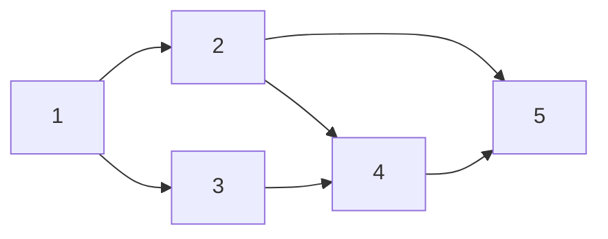
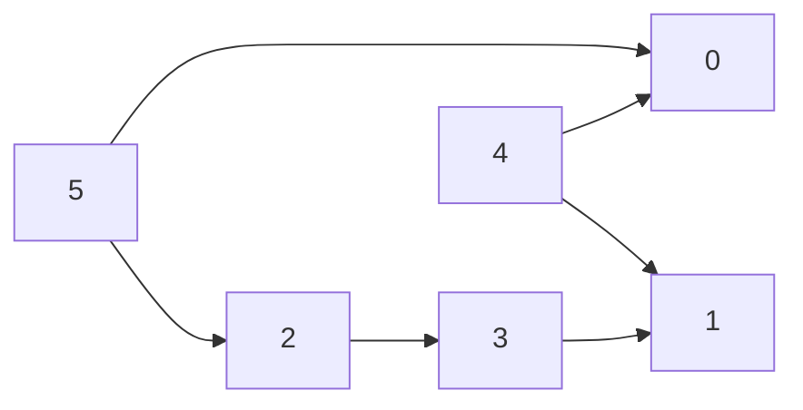

# 11. Topological Sort

## Problem Statement

> Given a directed acyclic graph (DAG) with `V` vertices labeled from `0` to `V-1`. The graph is represented using an adjacency list where `adj[i]` lists all nodes that node `i` points to. Find any valid topological sort of the graph.

**Example:**
```
Input:  V = 6, adj = [[], [], [3], [1], [0, 1], [0, 2]]
Output: [5, 4, 2, 3, 1, 0]
```

## Intuition

A topological sort takes a directed acyclic graph (DAG) and returns its nodes in an order where every node comes before the nodes it points to. It's used for scheduling tasks with dependencies, and it only exists if the graph has **no cycles**.



Since node 1 points to nodes 2 and 3, node 1 appears before them in the ordering. Likewise, since nodes 2 and 3 both point to node 4, they appear before it in the ordering. So `[1, 2, 3, 4, 5]` would be a valid topological ordering of the graph.

We'll use the following strategy:

1. Identify a node with no incoming edges (indegree = 0).
2. Add that node to the ordering.
3. Remove it from the graph.
4. Repeat.

> **Note:** Instead of actually removing nodes from the graph (and destroying our input!), we'll use a hash map to track each node's indegree. When we add a node to the topological ordering, we'll decrement the indegree of that node's neighbors — representing that those nodes now have one fewer incoming edge.

## Code

For this problem, the graph looks like this: `adj = [[], [], [3], [1], [0, 1], [0, 2]]`



```python
class Solution:
    def topoSort(self, V, adj):
        # First, calculate the indegree of the nodes
        indegree = {node: 0 for node in range(len(adj))}
        for index, neighbors in enumerate(adj):
            for v in neighbors:
                indegree[v] += 1

        # Track nodes with no incoming edges
        node_with_no_incoming_edges = []
        for node in range(len(adj)):
            if indegree[node] == 0:
                node_with_no_incoming_edges.append(node)

        # Initially, no nodes are in our ordering
        topological_ordering = []

        # As long as there are nodes with no incoming edges
        # that can be added to the ordering
        while len(node_with_no_incoming_edges) > 0:
            node = node_with_no_incoming_edges.pop()
            topological_ordering.append(node)

            # Decrement the indegree of that node's neighbors
            for neighbor in adj[node]:
                indegree[neighbor] -= 1
                # A neighbor with no more incoming edges is ready to add
                if indegree[neighbor] == 0:
                    node_with_no_incoming_edges.append(neighbor)

        # We've run out of nodes with no incoming edges
        if len(topological_ordering) == len(adj):
            return topological_ordering
        else:
            raise Exception("Graph has a cycle! No topological ordering exists.")
```

## Complexity Analysis

* **Time Complexity:** **O(V + E)** — in the worst case, you visit every vertex and every edge.
* **Space Complexity:** **O(V)** — for the indegree map and the list of nodes ready to process, each of which holds at most `V` entries.

## References

```bibtex
@misc{interviewcake2026toposort,
    author = {{Interview Cake}},
    title  = {Topological Sort: Algorithm, Examples & Code},
    year   = {2026},
    url    = {https://www.interviewcake.com/concept/python3/topological-sort},
    note   = {Accessed 2026-07-23; page last updated 2026-06-17}
}
```