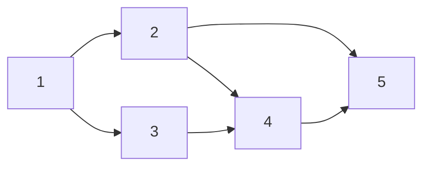
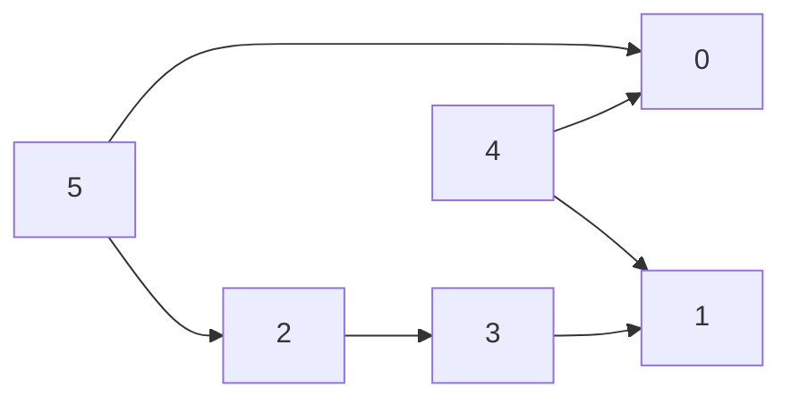
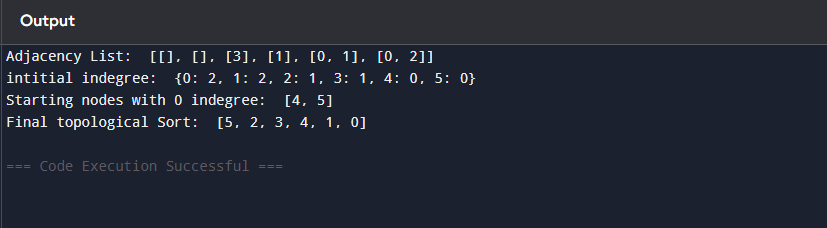

# 11. Topological Sort

## Problem Statement

> Given a directed acyclic graph (DAG) with `V` vertices labeled from `0` to `V-1`. The graph is represented using an adjacency list where `adj[i]` lists all nodes that node `i` points to. Find any valid topological sort of the graph.

**Example:**
```
Input:  V = 6, adj = [[], [], [3], [1], [0, 1], [0, 2]]
Output: [5, 4, 2, 3, 1, 0]
```

## Intuition

A topological sort takes a directed acyclic graph (DAG) and returns its nodes in an order where every node comes before the nodes it points to. It's used for scheduling tasks with dependencies, and it only exists if the graph has **no cycles**.


```mermaid
graph LR
    1 --> 2
    1 --> 3
    2 --> 4
    2 --> 5
    3 --> 4
    4 --> 5
```

Since node 1 points to nodes 2 and 3, node 1 appears before them in the ordering. Likewise, since nodes 2 and 3 both point to node 4, they appear before it in the ordering. So `[1, 2, 3, 4, 5]` would be a valid topological ordering of the graph.

We'll use the following strategy:

1. Identify a node with no incoming edges (indegree = 0).
2. Add that node to the ordering.
3. Remove it from the graph.
4. Repeat.

> **Note:** Instead of actually removing nodes from the graph (and destroying our input!), we'll use a hash map to track each node's indegree. When we add a node to the topological ordering, we'll decrement the indegree of that node's neighbors.

## Code

For this problem, the graph looks like this: `adj = [[], [], [3], [1], [0, 1], [0, 2]]`


```mermaid
graph LR
    5 --> 0
    4 --> 0
    5 --> 2
    2 --> 3
    3 --> 1
    4 --> 1
```

```python
from collections import defaultdict

adj = [[], [], [3], [1], [0, 1], [0, 2]]
print("Adjacency List: ", adj)

# Calculate indegree
indegree = {node: 0 for node in range(len(adj))}

for u, v in enumerate(adj):
    neighbor = v
    for i in neighbor:
        indegree[i] += 1

print("intitial indegree: ", indegree)

node_with_no_incoming_edges = []
topo_sort = []

# for all the nodes with indegree zero, append them into a temp. list
for k, v in indegree.items():
    if v == 0:
        node_with_no_incoming_edges.append(k)
        
print("Starting nodes with 0 indegree: ", node_with_no_incoming_edges)
        
# As long as there are nodes with no incoming edges
while len(node_with_no_incoming_edges) > 0:
    node = node_with_no_incoming_edges.pop()
    topo_sort.append(node)
    
    # decrement the indegree of the node
    for neighbor in adj[node]:
        indegree[neighbor] -= 1
        
        # if a neighbor with no more incoming nodes then
        if indegree[neighbor] == 0:
            node_with_no_incoming_edges.append(neighbor)
            
# if we run out of all nodes
if len(topo_sort) == len(adj):
    print("Final topological Sort: ", topo_sort)
else:
    print("The graph has a Cycle!")
```



## Complexity Analysis

* **Time Complexity:** 
    - Determine the _indegree_ for each node - $O(M)$
    - For nodes with no incoming edges - $O(N)$
    - Add nodes until we run out of nodes with no incoming edges, This will go $N$ times in the worst case scenario
        - Inside loop we also decrement the _indegree_ of the nodes we added in the list, Overall we'll endup doing one decrement for each edge - $O(M)$

    - Overall time complexity is $O(M+N)$

* **Space Complexity:** 
    - `indegree` - $O(N)$
    - `node_with_no_incoming_edges` - In a graph with NO edges, in the worst case it will be $O(N)$
    - `topo_sort` - graph with no cycle, this will have every node $O(N)$
    - Overall space complexity will be $O(N)$

## References

```bibtex
@misc{interviewcake2026toposort,
    author = {{Interview Cake}},
    title  = {Topological Sort: Algorithm, Examples & Code},
    year   = {2026},
    url    = {https://www.interviewcake.com/concept/python3/topological-sort},
    note   = {Accessed 2026-07-23; page last updated 2026-06-17}
}
```