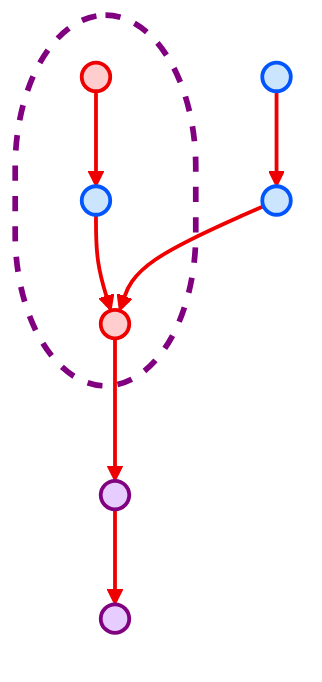

# 13. Largest Color Value in a Directed Graph 

## Problem Statement
There is a <b>directed graph</b> of `n` colored nodes and `m` edges. The nodes are numbered from `0` to `n - 1`.

You are given a string <code>colors</code> where `colors[i]` is a lowercase English letter representing the <b>color</b> of the `ith` node in this graph (<b>0-indexed</b>). You are also given a 2D array `edges` where `edges[j] = [aj, bj]` indicates that there is a <b>directed edge</b> from node `aj` to node `bj`.

A valid <b>path</b> in the graph is a sequence of nodes `x1 -> x2 -> x3 -> ... -> xk` such that there is a directed edge from `xi` to `xi+1` for every `1 <= i < k`. The <b>color value</b> of the path is the number of nodes that are colored the <b>most frequently</b> occurring color along that path.

Return the <em>largest color value</em> of any valid path in the given graph, or `-1` if the <em>graph contains a cycle</em>.

<p>&nbsp;</p>
<p><strong class="example">Example 1:</strong></p>

<pre>
<strong>Input</strong>: colors = "abaca", edges = [[0,1],[0,2],[2,3],[3,4]]
<strong>Output</strong>: 3
<strong>Explanation</strong>: The path 0 -> 2 -> 3 -> 4 contains 3 nodes that are colored "a" (red in the above image).
</pre>

<p><strong class="example">Example 2:</strong></p>

<pre>
<strong>Input</strong>: colors = "a", edges = [[0,0]]
<strong>Output</strong>: -1
<strong>Explanation</strong>: There is a cycle from 0 to 0.
</pre>

<p>&nbsp;</p>
<p><strong>Constraints:</strong></p>

<ul>
    <li><code>n == colors.length</code></li>
    <li><code>m == edges.length</code></li>
    <li><code>1 <= n <= 10^5</code></li>
    <li><code>0 <= m <= 10^5</code></li>
    <li><code>colors</code> consists of lowercase English letters.</li>
    <li><code>0 <= aj, bj < n</code></li>
</ul>

## Intuition
- So my initial intuition about this problem is to perform a DFS from each node and calculate the most frequently occuring color



## Code 

```python
class Solution:
    def largestPathValue(self, colors: str, edges: List[List[int]]) -> int:
        
```

## Complexity Analysis
In graph theory problems, it is standard to express time and space complexity in terms of $V$ (Vertices/Nodes, which is `numCourses`) and $E$ (Edges, which is the number of pairs in `prerequisites`).

* **Time Complexity:** 

* **Space Complexity:**
