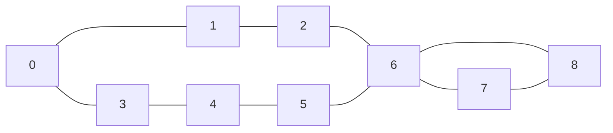
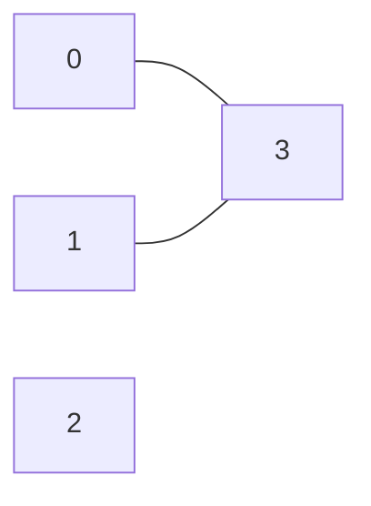

# 15. Shortest Path in Unweighted Graph

## Problem Statement

Given an undirected graph with `V` vertices numbered from `0` to `V-1` and `E` edges, where `edges[i] = [u, v]` denotes an undirected edge between vertex `u` and vertex `v`, given two vertices `src` and `dest`, find the length of the shortest path from `src` to `dest`. If there is no path between `src` and `dest`, return `-1`.

Note: All edges have a unit weight of 1.

**Example:**
```
Input: V = 9, edges[][] = [[0, 1], [0, 3], [1, 2], [3, 4], [4, 5], [2, 6], [5, 6], [6, 7], [6, 8], [7, 8]], src = 0, dest = 8
Output: 4
Explanation: One of the shortest paths from vertex 0 to vertex 8 is 0 -> 1 -> 2 -> 6 -> 8, which contains 4 edges.
```




```
Input: V = 4, edges[][]= [[0, 3], [1, 3]], src = 3, dest = 2
Output: -1
Explanation: There is no path between vertices 3 and 2.
```



<p><strong>Constraints:</strong></p>
<ul>
    <li><code>1 ≤ V ≤ 10^4</code></li>
    <li><code>0 ≤ E ≤ V × (V - 1) / 2</code></li>
    <li><code>0 ≤ edges[i][0], edges[i][1] < V</code></li>
</ul>


## Intuition
- My initial thaughts are to use BFS since source and destination are give so we need to initiate from the starting node and check for every node (This is brute force approach) 
- The initial thaught was almost correct, We need to store the distance along with node we are encountering and perform the standard BFS.

## Code

```python
from collections import defaultdict, deque

class Solution:
    def shortestPath(self, V, edges, src, dest):
        # First create the adjecency list
        lst = defaultdict(list)
        for u, v in edges:
            lst[u].append(v)
            lst[v].append(u)

        visited = [0]*V

        queue = deque()
        # Queue stores tuples of (current_node, distance_from_src)
        queue.append((src, 0))
        visited[src] = 1

        while queue:
            node, dist = queue.popleft()

            if node == dest:
                return dist

            
            for neighbor in lst[node]:
                if not visited[neighbor]:
                    visited[neighbor] = 1
                    queue.append((neighbor, dist+1))

        return -1       
```

## Complexity Analysis
In graph theory problems, it is standard to express time and space complexity in terms of $V$ (Vertices/Nodes) and $E$ (Edges).

* **Time Complexity:** 
    - Since it's an undirected graph
    - Time for creating adjecency list will be $O(E)$ (WHY?) -> We are reading the list of all given `edges`
    - Initializing the visited array will take $O(V)$ time
    - Initializing queue will take constant time that $O(1)$
    - The BFS traversal 
        - `while` loop takes at most $O(V)$ time (WHY?) -> because of `visited` array, a node will be added to it atmost one time
        - How many times the `for` loop runs? It runs once for every neighboring node connected
        - by the time `while` loop finishes every city we will have looked every single neighboring edge, therefor $O(E)$ 
    - Total time -  $O(E + V + 1 + E)$  ~  $O(V + E)$ time

* **Space Complexity:**
    - `lst` - Stores relationship between nodes - $O(V + E)$ (WHY?) -> To build the map we need to first intialize the entry for every single node $O(V)$ and then we write down the neighboring nodes $O(E)$
    - `visited` - visited array will be - $O(V)$
    - `queue` - in the worst case it will store all the nodes & dist - $O(V)$
    - Total space is - $O(V + E + V + V)$ ~ $O(3V + E)$ ~ $O(V + E)$