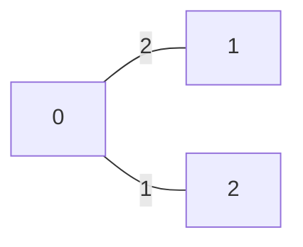
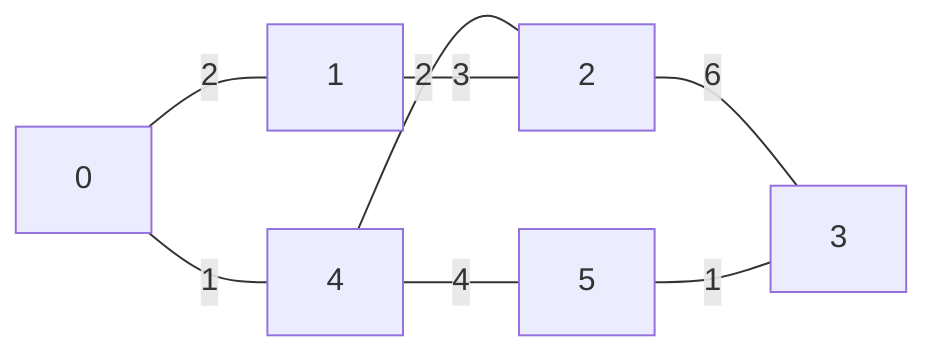

# 15. Shortest path in Directed Acyclic Graph

## Problem Statement

Given a Directed Acyclic Graph (DAG) with V vertices numbered from 0 to V - 1 and E weighted directed edges represented by a 2D array edges[][], where edges[i] = [u, v, wt] denotes a directed edge from vertex u to vertex v with weight wt, find the shortest distance from the source vertex 0 to every other vertex.

Return an array of size V, where the i-th element represents the shortest distance from the source vertex 0 to vertex i. If a vertex is not reachable from the source, return -1 for that vertex.


**Example:**
```
Input: V = 4, edges = [[0,1,2], [0,2,1]]
Output: [0, 2, 1, -1]
Explanation: Shortest path from 0 to 1 is 0->1 with edge weight 2. Shortest path from 0 to 2 is 0->2 with edge weight 1. There is no way we can reach 3, so it's -1 for 3.
```




```
Input: V = 6, edges = [[0,1,2], [0,4,1], [4,5,4], [4,2,2], [1,2,3], [2,3,6], [5,3,1]]
Output: [0, 2, 3, 6, 1, 5]
Explanation: Shortest path from 0 to 1 is 0->1 with edge weight 2. Shortest path from 0 to 2 is 0->4->2 with edge weight 1+2=3. Shortest path from 0 to 3 is 0->4->5->3 with edge weight 1+4+1=6. Shortest path from 0 to 4 is 0->4 with edge weight 1.Shortest path from 0 to 5 is 0->4->5 with edge weight 1+4=5.
```



<p><strong>Constraints:</strong></p>
<ul>
    <li><code>1 ≤ V ≤ 100</code></li>
    <li><code>1 ≤ E ≤ min((V*(V-1))/2,4000)</code></li>
    <li><code>0 ≤ edges[i][0], edges[i][1] < V</code></li>
    <li><code>0 ≤  edges[i][2] ≤10^5</code></li>
</ul>


## Intuition

## Code

```python
from collections import defaultdict, deque

class Solution:
    def shortestPath(self, V: int, edges: list[list[int]]) -> list[int]:
        # code here
        lst = defaultdict(list)
        for u, v, w in edges:
            lst[u].append((v, w))
            
        dist = [float('inf')]*V
        dist[0] = 0
            
        q = deque()
        q.append(0)
        
        while q:
            node = q.popleft()
            
            for neighbor, wt in lst[node]:
                new_dist = dist[node] + wt
                
                # Only explore if this path is strictly better than what we know
                if new_dist < dist[neighbor]:
                    dist[neighbor] = new_dist
                    q.append(neighbor)
                    
        return [d if d != float('inf') else -1 for d in dist]
```

## Complexity Analysis
In graph theory problems, it is standard to express time and space complexity in terms of $V$ (Vertices/Nodes) and $E$ (Edges).

* **Time Complexity:** 

* **Space Complexity:**
