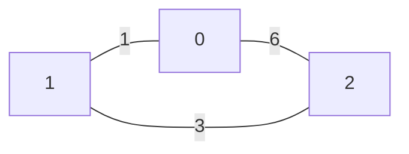
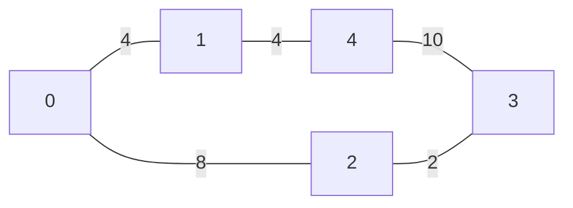

# 17. Dijkstra Algorithm

## Problem Statement
Given an undirected, weighted graph with V vertices numbered from `0` to `V-1` and `E` edges, represented by 2d array `edges[][]`, where `edges[i]=[u, v, w]` represents the edge between the nodes `u` and `v` having `w` weight.
Find the shortest distance of all the vertices from the source vertex `src`, and return an array of integers where the `ith` element denotes the shortest distance between `ith` node and source vertex `src`.

> [!NOTE]
> The Graph is connected and doesn't contain any negative weight edge
> It is guaranteed that all the shortest distance will fit in a 32-bit integer.


<p>&nbsp;</p>
<p><strong class="example">Example 1:</strong></p>

<pre>
<strong>Input:</strong> V=3, edges[][] = [[0, 1, 1], [1, 2, 3], [0, 2, 6]], src = 2
<strong>Output:</strong> [4, 3, 0]
<strong>Explanation:</strong> 
Shortest Paths:
For 2 to 0 minimum distance will be 4. By following path 2 &rarr; 1 &rarr; 0
For 2 to 1 minimum distance will be 3. By following path 2 &rarr; 1
For 2 to 2 minimum distance will be 0. By following path 2 &rarr; 2
</pre>



<p><strong class="example">Example 2:</strong></p>

<pre>
<strong>Input:</strong> V = 5, edges[][] = [[0, 1, 4], [0, 2, 8], [1, 4, 6], [2, 3, 2], [3, 4, 10]], src = 0
<strong>Output:</strong> [0, 4, 8, 10, 10]
<strong>Explanation:</strong> 
Shortest Paths: 
For 0 to 1 minimum distance will be 4. By following path 0 &rarr; 1
For 0 to 2 minimum distance will be 8. By following path 0 &rarr; 2
For 0 to 3 minimum distance will be 10. By following path 0 &rarr; 2 &rarr; 3 
For 0 to 4 minimum distance will be 10. By following path 0 &rarr; 1 &rarr; 4
</pre>



## Intuition

## Code 

```python
```

## Complexity Analysis

* **Time Complexity:** 

* **Space Complexity:**
